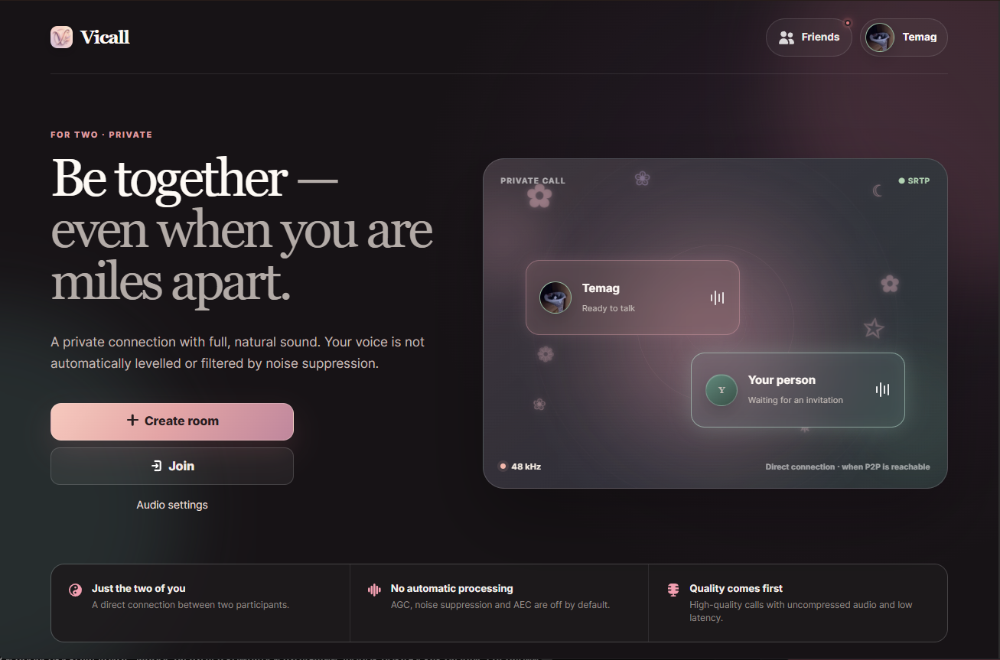
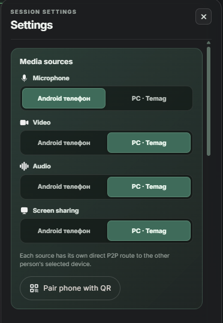
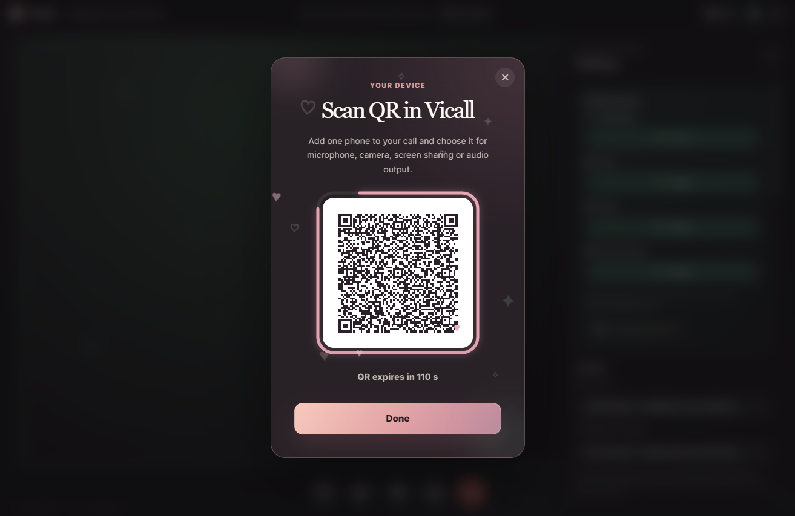
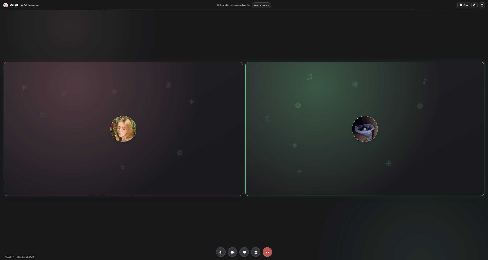
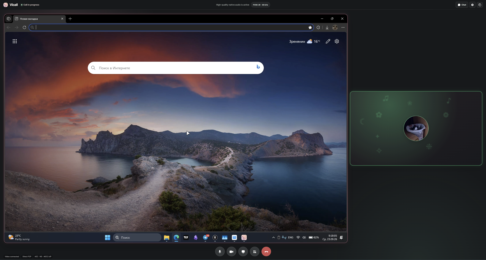
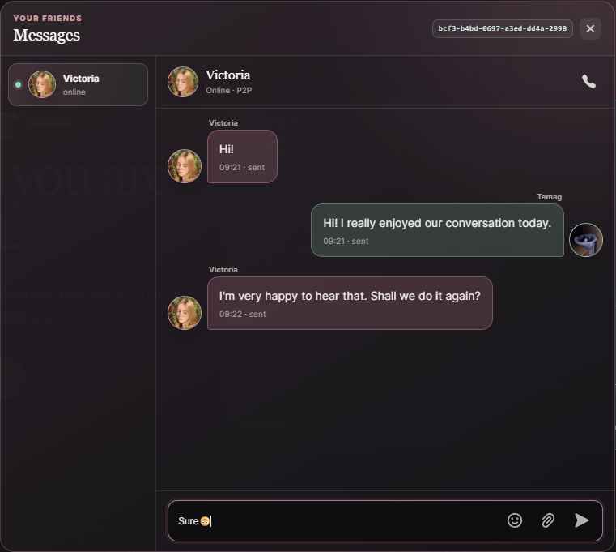

  

<h1 align="center">Vicall</h1>

  <strong>Private P2P calls with high-quality audio, explicit media control and multi-device calling.</strong>

  <a href="https://github.com/DaytonCL/Vicall/releases/latest"><strong>Download Vicall</strong></a>
  ·
  <a href="https://github.com/DaytonCL/Vicall/issues">Report an issue</a>

  

## Download

The latest builds are available in [GitHub Releases](https://github.com/DaytonCL/Vicall/releases/latest).

| Platform | Status |
| --- | --- |
| Windows x64 | Available |
| Android | Available |
| iOS | In development |

## What Vicall is

Vicall is a calling app built for long conversations where audio quality, connection behavior and media routing should stay under the user's control.

The product started as a two-person audio call and grew into a shared call space with video, screen sharing, messaging, paired devices and small shared activities.

### Direct P2P communication

Audio, video and data are sent directly between participants whenever a reachable P2P route is available. Signaling establishes the session, while call media stays on the direct connection instead of being routed through a central media server.

### Audio-first by design

Vicall keeps audio as the primary part of the call:

- 48 kHz stereo audio;
- uncompressed PCM or high-bitrate Opus modes;
- optional echo cancellation;
- optional full voice processing;
- explicit microphone and audio-output selection;
- recovery logic that treats restored audio delivery as part of a successful reconnection.

Processing is a choice rather than something silently forced on every call.

### Use a second device as part of the same call

A participant can pair another device with the active call and use it as an additional media source.

For example, you can keep the call on the computer while using a phone as:

- the microphone;
- the camera;
- an additional media device;
- a paired companion for the same participant identity.

Media ownership stays attached to the person, not to a single device, so adding a phone does not create another participant in the conversation.

  

### Pair a phone with QR

A phone can be connected to an active desktop call with a temporary QR flow. Pairing links the companion device to the current participant and makes its available media sources selectable from the call settings.

  

### Camera, screen sharing and flexible call space

Camera and screen sharing are independent sources. They can coexist in the same call and remain visually distinct, so the layout can adapt to what people are actually doing rather than forcing everything into one video tile.

  
  

### Friends, messages and file transfer

Vicall also supports persistent connections beyond the live media streams:

- friend requests with explicit acceptance;
- direct messages;
- friend verification by fingerprint;
- incoming and outgoing calls from conversations;
- encrypted P2P file transfer with recipient acceptance.

  

### Shared mini-apps

Mini-apps run inside the call session and reuse its encrypted data channel for invitations, synchronized state and exit. The first playable activity is Air Hockey, with the framework designed to support more shared activities over time.

## Network model

Vicall is direct-first. Media is not relayed through a TURN or SFU server.

When two devices cannot establish a reachable direct ICE route, a shared VPN or another mutually reachable network path may be required. This is an intentional trade-off of the direct connection model.

## Installation

### Windows

1. Open the [latest release](https://github.com/DaytonCL/Vicall/releases/latest).
2. Download `Vicall_0.6.6_x64-setup.exe`.
3. Run the installer.
4. Launch Vicall.

### Android

1. Open the [latest release](https://github.com/DaytonCL/Vicall/releases/latest).
2. Download the Android APK.
3. Allow installation from the source you used to download the file, if Android asks.
4. Install and launch Vicall.

## Current version

**Vicall 0.6.6**

The release page includes the downloadable builds and SHA-256 integrity hashes.

## Feedback

Use [GitHub Issues](https://github.com/DaytonCL/Vicall/issues) for reproducible bugs and public feedback.

When reporting a problem, include the Vicall version, operating system, the shortest steps that reproduce the issue, and what you expected to happen.

Please do not post room links, identity fingerprints, private files, access tokens or other sensitive data in a public issue.
